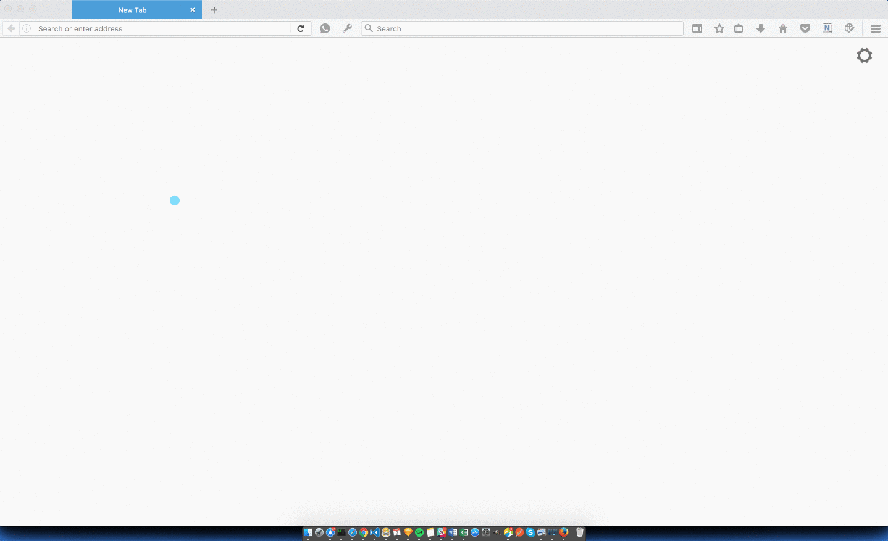

# Send Firefox Sidebar

Send Firefox on your sidebar

This feature has been added to `needs:product` in the send firefox project, see this [issue](https://github.com/mozilla/send/issues/385).

## Run!

Use `Ctrl+Shift+O` (PC/Linux) or `⌘+Shift+O` (Mac) to activate/deactivate sidebar

